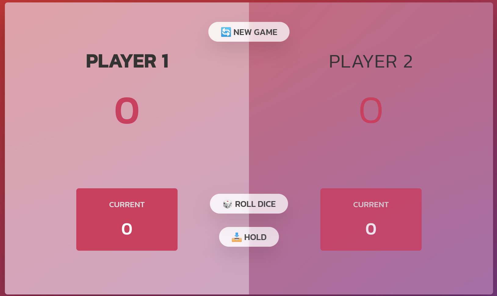

## Pig Game 

## Rule of game:
1. The game with 2 players;
2. The first player roll the dice and in current numbers place we'll see the number of roll;
3. The current player can continue the game and roll the dice again, which the new number must be added to the last one;
4. Or Hold the number and after that the game round to other player; 
5. But when the dice show the '1' all current numbers return to '0' and the round go to the next player. That's why we must save the current number sometimes;
6. The first player who rich the 50 point in game will Win;


## Install

You can install this game on your PC and run it using npm

```sh
npm init
```

```sh
npm start
```

